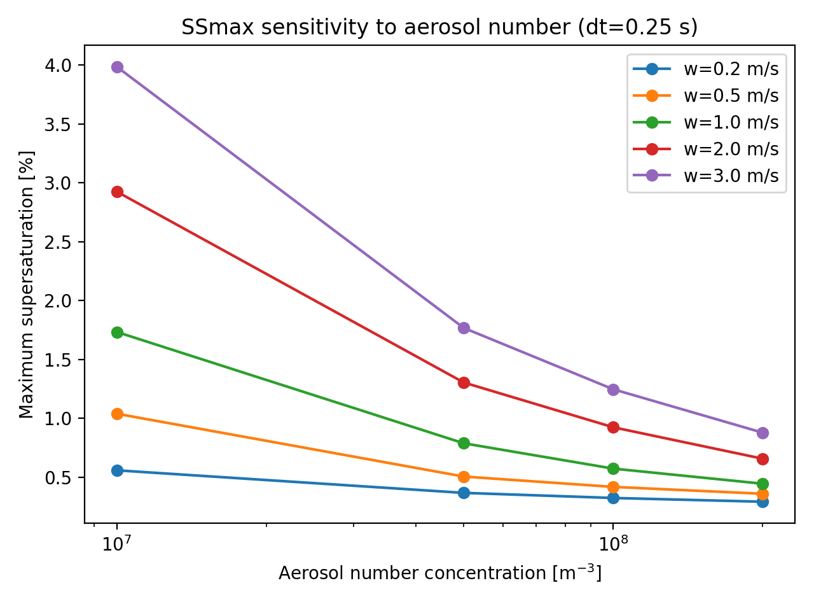
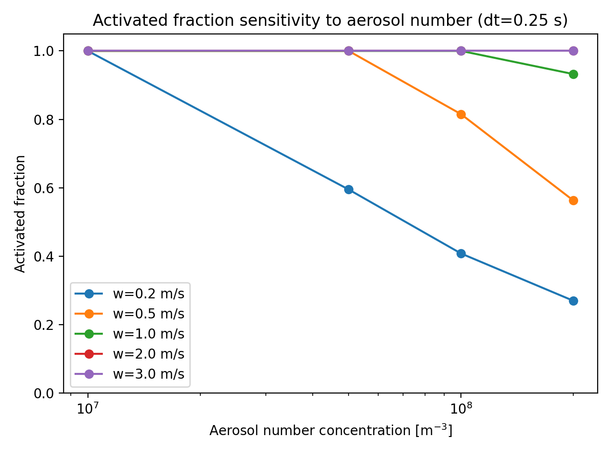

# 🌥️ Warm-Cloud Two-Moment Parcel Microphysics


## Overview

This repository contains an experimental Python framework for investigating cloud microphysical processes in a controlled parcel-model environment.

The current development focus is a **warm-cloud two-moment microphysics model** in which the prognostic cloud variables are:

- cloud-droplet number concentration, `Nc` [m^-3]
- cloud-water mixing ratio, `qc` [kg kg^-1]

The framework includes aerosol activation, Maxwell-type condensational growth, supersaturation diagnostics, timestep and parameter-sensitivity experiments, an independent Abdul-Razzak et al. (1998) analytical activation benchmark, and diagnostic comparison with the KiD-A `warm1` case.

The repository also contains earlier exploratory warm-rain and mixed-phase experiments.

> **Status:** This is a research prototype under development. The two-moment scheme is not yet a validated cloud microphysics parameterization.

---

## 🎯 Scientific Objectives

The current two-moment development aims to:

1. represent both cloud-droplet number and cloud-water mass;
2. quantify aerosol activation rather than describe it only qualitatively;
3. diagnose activation time, time to activation, activated fraction, and maximum supersaturation;
4. investigate sensitivity to dynamical and aerosol parameters;
5. test numerical timestep sensitivity;
6. compare parcel activation behaviour with an independent analytical activation benchmark;
7. investigate differences between the Python parcel model and KiD-A under carefully documented configurations.

---

# ☁️ Two-Moment Warm-Cloud Framework

## Prognostic Cloud Moments

The model predicts two cloud moments:

```text
Nc = cloud-droplet number concentration [m^-3]
qc = cloud-water mixing ratio [kg kg^-1]

```

An equivalent-volume mean droplet radius is diagnosed from the two moments.

For a monodisperse representation:

```math
r = \left(
\frac{3 \rho_{air} q_c}
{4 \pi \rho_w N_c}
\right)^{1/3}
```

This provides a direct connection between droplet number, condensed-water mass, and characteristic droplet size.

---

## 💧 Aerosol Activation

Activation increases cloud-droplet number and transfers the corresponding seed-droplet mass from water vapour to cloud water.

Two parcel activation options are available for controlled experiments.

### `simple_kappa`

A simplified monodisperse κ-Köhler activation treatment.

### `lognormal_kohler`

A lognormal critical-supersaturation threshold treatment.

This option uses a distribution of aerosol critical supersaturations and allows progressive activation of an aerosol population.

It should **not** be interpreted as the complete Abdul-Razzak et al. (1998) analytical activation parameterization.

---

# 📊 Activation Diagnostics

The two-moment runner explicitly diagnoses:

- first saturation time;
- first activation time;
- time from saturation to activation;
- maximum supersaturation (`SSmax`);
- time of maximum supersaturation;
- final activated fraction;
- final cloud-droplet number concentration;
- cloud-water mixing ratio;
- equivalent mean droplet radius;
- total-water conservation error.

Additional threshold diagnostics determine the time and supersaturation associated with:

```text
1% activation
50% activation
90% activation
```

These diagnostics allow activation behaviour to be analysed quantitatively rather than only qualitatively.

---

# 🧪 Baseline Activation Experiment

A representative baseline configuration uses:

```text
updraft velocity       = 1.0 m s^-1
aerosol concentration  = 1.0e8 m^-3
dry aerosol radius     = 0.05 micrometres
geometric sigma        = 1.4
kappa                   = 0.3
timestep                = 0.25 s
```

For the `lognormal_kohler` parcel activation treatment, a representative run produced approximately:

| Diagnostic | Value |
|---|---:|
| Saturation time | 94.25 s |
| First activation time | 94.25 s |
| 1% activation delay | 0.75 s |
| 50% activation delay | 2.75 s |
| 90% activation delay | 5.75 s |
| Maximum supersaturation | 0.5399% |
| Final activated fraction | 0.9947 |
| Final Nc | 9.95 × 10^7 m^-3 |
| Final qc | 2.88 × 10^-3 kg kg^-1 |
| Mean droplet radius | 18.56 micrometres |

These values are model diagnostics and should not be interpreted as validation against observations.

---

# 🔬 Parameter-Sensitivity Experiments

Systematic parameter sweeps have been implemented to investigate sensitivity to:

- updraft velocity, `w`;
- aerosol number concentration, `N`;
- dry aerosol radius;
- aerosol hygroscopicity, `κ`.

The main diagnostic outputs include:

- `SSmax`;
- activation time;
- activation delay;
- activated fraction;
- critical supersaturation;
- mean droplet radius.

---

## Aerosol Number Sensitivity



*Maximum supersaturation as a function of aerosol number concentration.*



*Activated aerosol fraction as a function of aerosol number concentration.*

---

## Dry Aerosol Radius Sensitivity

The dry-radius sweep investigates how aerosol particle size changes critical supersaturation, activation timing, maximum supersaturation, and activated fraction.

---

## Hygroscopicity Sensitivity

The κ sweep investigates how aerosol hygroscopicity changes the critical supersaturation and subsequent activation response.

---

# ⏱️ Numerical Timestep Sensitivity

A timestep-convergence experiment was performed before the main parameter sweeps.

A timestep of:

```text
dt = 0.25 s
```

was selected for the main sensitivity experiments, with:

```text
dt = 0.10 s
```

used as a finer numerical reference.

Numerical convergence is distinct from physical validation.

---

# 📚 Independent ARG1998 Analytical Benchmark

The parcel activation calculation is compared with an independent implementation based on:

**Abdul-Razzak, Ghan & Rivera-Carpio (1998)**  
*A parameterization of aerosol activation: 1. Single aerosol type.*

The analytical calculation is used as a **standalone analytical benchmark**, not as the parcel activation algorithm itself.

For the representative baseline experiment:

```text
lognormal threshold parcel SSmax ≈ 0.5399%
ARG1998 analytical SSmax         ≈ 0.5718%

lognormal threshold parcel activated fraction ≈ 0.9947
ARG1998 analytical activated fraction         ≈ 0.9962
```

The parcel `lognormal_kohler` treatment and the ARG1998 analytical parameterization are distinct activation closures.

Therefore, differences between them should not automatically be interpreted as model errors or validation errors.

No coefficients are tuned simply to force agreement with the analytical benchmark.

The current ARG1998 benchmark also contains provisional assumptions, including the representative droplet radius used in the condensational-growth coefficient.

---

# 🌧️ KiD-A Warm1 Investigation

The KiD-A `warm1` configuration was used for an external diagnostic comparison.

Important configuration information identified from the KiD namelist and source includes:

```text
case                 = warm1 (icase = 101)
microphysics scheme  = Thompson09
maximum updraft      = 2.0 m s^-1
forcing duration     = 600 s
aerosol N            = 50 × 10^6 m^-3
aerosol dry radius   = 0.05 micrometres
geometric sigma      = 1.4
KiD timestep         = 1.0 s
output interval      = 30 s
```

The KiD configuration also contains a fixed cloud-number setting:

```text
SET_NC = 100 cm^-3
```

This fixed cloud-number closure and the initialized aerosol population are separate quantities and should not be treated as equivalent.

---

## Warm1 Vertical-Velocity Forcing

During the first 600 s, the warm1 forcing follows:

```math
w(t)=2\sin\left(\frac{\pi t}{600}\right)
```

with zero vertical velocity after the forcing period.

For a parcel beginning at approximately 25 m, the corresponding analytical displacement during the forcing period is:

```math
z(t)=25+
\frac{1200}{\pi}
\left[
1-\cos\left(\frac{\pi t}{600}\right)
\right]
```

The final height after the forcing period is approximately:

```text
788.94 m
```

---

# ☁️ Matched Python Warm1 Parcel Experiment

A dedicated Python runner was created to reproduce the KiD warm1 vertical-velocity forcing while retaining the two-moment parcel microphysics.

The approximate initial state extracted from the first available KiD output was:

```text
T0 ≈ 297.665 K
p0 ≈ 99724 Pa
qv0 ≈ 0.0149595 kg kg^-1
z0 = 25 m
```

The Python experiment used:

```text
activation scheme = lognormal_kohler
aerosol N         = 50 × 10^6 m^-3
dry radius        = 0.05 micrometres
sigma             = 1.4
kappa             = 0.3
dt                = 0.25 s
```

Representative diagnostics were:

```text
first saturation       ≈ 396.5 s
first activation       ≈ 396.5 s
saturation height      ≈ 591.9 m
SSmax                  ≈ 0.992%
final activated fraction ≈ 0.99994
```

The first resolved cloud along the extracted KiD trajectory appears between approximately 390 and 420 s.

This timing agreement is useful diagnostically, but it is **not physical validation**.

---

# 📈 Direct KiD–Python Parcel Comparison

A trajectory was reconstructed through the KiD `warm1` output and compared with the Python two-moment parcel.

Before cloud formation, temperature and water-vapour differences were relatively small.

After condensation began, the solutions diverged substantially.

At approximately 600 s:

| Quantity | KiD trajectory | Original Python parcel |
|---|---:|---:|
| Temperature | 290.442 K | 291.294 K |
| qv | 0.0137716 kg kg^-1 | 0.0145203 kg kg^-1 |
| Cloud water | 0.0010995 kg kg^-1 | 0.0004391 kg kg^-1 |

KiD also contains approximately:

```text
rain water ≈ 9.92 × 10^-5 kg kg^-1
```

at this point.

The original Python parcel therefore contains substantially less condensed water than the KiD trajectory.

However, this direct discrepancy should **not** be interpreted automatically as a microphysics validation failure because the two experiments do not use equivalent thermodynamic and dynamical frameworks.

---

# 🔍 Source-Level Diagnosis of the KiD Comparison

Inspection of the KiD `warm1` namelist and source code identified two important settings:

```text
L_FIX_THETA = True
L_PUPDATE   = False
```

With `L_FIX_THETA=True`, the KiD warm1 case does not prognostically accumulate the microphysical potential-temperature tendency in the same way as the Lagrangian Python parcel accumulates latent-heating feedback.

With `L_PUPDATE=False`, KiD does not perform the optional timestep pressure/Exner update.

The Python parcel, in contrast, follows a Lagrangian thermodynamic trajectory with dynamically evolving parcel pressure and persistent latent-heating feedback.

The two experiments are therefore **not thermodynamically equivalent**.

This is an important result because it means that tuning aerosol activation, cloud number, or the Maxwell condensational-growth coefficient simply to reproduce the direct KiD cloud-water curve would not be scientifically justified.

---

# 💧 Thompson09 Condensation Diagnosis

Inspection of the Thompson09 source shows that cloud condensation/evaporation is treated using a Newton-iteration saturation-adjustment-like calculation.

The Thompson condensation calculation directly adjusts:

```text
qv
cloud water
temperature
```

towards water saturation.

The fixed cloud number `Nt_c` does not directly appear in this condensation adjustment.

This differs structurally from the explicit Maxwell droplet-growth treatment used in the Python parcel.

However, an additional Python saturation-adjustment experiment showed that replacing Maxwell growth alone did **not** remove the large final condensed-water difference.

Therefore, the condensational-growth closure alone is unlikely to be the dominant explanation for the original direct KiD–parcel discrepancy.

---

# 🧭 Fixed-Environment KiD Diagnostic

A separate diagnostic experiment was developed to isolate the thermodynamic-framework difference.

This experiment follows the warm1 vertical trajectory but uses:

- the RICO potential-temperature profile;
- fixed hydrostatic Exner/pressure;
- fixed-environment temperature;
- positive-supersaturation adjustment;
- no persistent parcel latent-heating feedback.

This experiment is deliberately a **diagnostic calculation**, not a replacement for the two-moment model and not a validation experiment.

At approximately 600 s:

| Quantity | Fixed-environment Python | KiD trajectory |
|---|---:|---:|
| Temperature | 290.471 K | 290.442 K |
| qv | 0.0137698 kg kg^-1 | 0.0137716 kg kg^-1 |
| Total condensed water | 0.0011897 kg kg^-1 | 0.0011987 kg kg^-1 |

The final condensed-water difference is less than approximately 1%.

At approximately 570 s, the fixed-environment condensed water also differs from KiD by less than approximately 1%.

The early-cloud period shows larger relative differences, partly because the absolute condensed-water values are still small and the KiD trajectory is sampled from discrete model output levels and times.

The close final thermodynamic and total-condensed-water agreement strongly supports the diagnosis that the original discrepancy was dominated by differences in the thermodynamic/dynamical framework.

It does **not** constitute validation of the two-moment microphysics.

---

# 💧 Condensation-Closure Diagnostic

A second diagnostic experiment replaced explicit Maxwell growth with positive-supersaturation adjustment while retaining the original Lagrangian parcel thermodynamics.

The final cloud-water mixing ratio changed by less than approximately 0.2%.

This provides evidence that simply replacing the Maxwell growth treatment is insufficient to explain the much larger original KiD–parcel discrepancy.

It also demonstrates why model coefficients should not be tuned before ensuring that the compared dynamical and thermodynamic frameworks are equivalent.

---

# 🧮 Water Conservation

The warm-cloud parcel experiments explicitly monitor total water.

For the current vapour-plus-cloud system:

```text
q_total = qv + qc
```

Representative simulations conserve total water to numerical precision when no external water source or sink is included.

This provides an important numerical consistency check.

Water conservation alone does **not** establish physical validation.

---

# ✅ Automated Tests

The two-moment development includes automated tests for:

- moment consistency;
- water conservation;
- activation limits;
- activation threshold diagnostics;
- runner behaviour;
- thermodynamic state validity;
- numerical invariants;
- legacy activation-scheme compatibility.

The latest checked development state passes:

```text
33 tests
```

These tests provide evidence of software and numerical consistency.

They should **not** be described as physical validation.

---

# ▶️ Reproducing the Main Experiments

The principal runners are located in:

```text
parcel_model/
```

Examples include:

```text
run_two_moment_warm.py
run_two_moment_kid_warm1.py
run_two_moment_kid_warm1_saturation_adjustment.py
run_two_moment_kid_warm1_fixed_environment.py
extract_kid_warm1_trajectory.py
save_two_moment_kid_warm1_trajectory.py
compare_kid_python_warm1.py
```

Parameter-sweep and diagnostic scripts are also stored within the repository.

Before reproducing an experiment, inspect the runner configuration so that timestep, activation scheme, aerosol properties, thermodynamic assumptions, and forcing options are explicitly documented.

---

# 📁 Key Project Structure

```text
python-cloud-model/
├── parcel_model/
│   ├── two_moment_warm.py
│   ├── run_two_moment_warm.py
│   ├── run_two_moment_kid_warm1.py
│   ├── run_two_moment_kid_warm1_saturation_adjustment.py
│   ├── run_two_moment_kid_warm1_fixed_environment.py
│   ├── extract_kid_warm1_trajectory.py
│   ├── save_two_moment_kid_warm1_trajectory.py
│   └── compare_kid_python_warm1.py
│
├── data/
│   ├── model output
│   ├── parameter-sweep results
│   └── diagnostic figures
│
├── tests and development checks
├── MANUSCRIPT.md
└── README.md
```

The exact repository contents continue to evolve as the model is developed.

---

# ❄️ Earlier Mixed-Phase Development

The repository also contains earlier exploratory work on:

- biological ice nucleation;
- mixed-phase Maxwell growth;
- vapour competition;
- Bergeron–Findeisen-type behaviour;
- warm-rain autoconversion;
- KiD-inspired forcing experiments.

These experiments remain useful as exploratory model-development work.

The current development focus is the **warm-cloud two-moment framework and quantitative aerosol-activation diagnostics**.

---

# 🔬 Current Scientific Interpretation

The present development supports the following conclusions:

1. A provisional warm-cloud two-moment framework with prognostic `Nc` and `qc` is operational.
2. Aerosol activation is evaluated using quantitative timing, fraction, and supersaturation diagnostics.
3. Updraft and aerosol properties produce measurable changes in activation behaviour.
4. Numerical timestep sensitivity has been explicitly assessed.
5. The `lognormal_kohler` parcel threshold treatment is not the full ARG1998 analytical activation parameterization.
6. ARG1998 is used as an independent analytical benchmark.
7. Differences between the parcel threshold treatment and ARG1998 should not automatically be interpreted as validation errors.
8. The original direct KiD warm1 discrepancy cannot be attributed to condensational-growth physics alone.
9. The KiD warm1 and original Python parcel experiments use different thermodynamic/dynamical frameworks.
10. A fixed-environment diagnostic reproduces KiD warm1 thermodynamics and total condensed water much more closely.
11. Further controlled comparisons with genuinely equivalent dynamics and thermodynamics are required before the two-moment scheme can be described as validated.

---

# ⚠️ Limitations

The current two-moment framework remains intentionally simplified.

Important limitations include:

- simplified aerosol activation treatments;
- monodisperse/equivalent-radius representation of cloud droplets;
- no fully prognostic aerosol size distribution;
- no complete two-moment rain category in the new warm-cloud framework;
- no detailed collision-coalescence treatment equivalent to Thompson09;
- no sedimentation in the basic parcel two-moment model;
- no turbulence or entrainment;
- differences between Lagrangian parcel and Eulerian KiD dynamics;
- timestep-resolved activation threshold crossings;
- provisional assumptions within the independent ARG1998 benchmark.

The model is therefore intended for:

```text
research development
process diagnosis
controlled sensitivity experiments
numerical testing
```

rather than operational cloud prediction.

---

# 🚧 Repository Status

The current implementation should be described as:

> **Experimental warm-cloud two-moment research prototype under development and diagnostic evaluation.**

It should **not** yet be described as a validated microphysics scheme.

The principal current development priorities are:

1. further controlled activation tests;
2. clearer process-level comparison with KiD;
3. comparison under genuinely equivalent thermodynamic forcing;
4. continued sensitivity analysis;
5. literature-based evaluation without empirical tuning;
6. documentation of every model option used in comparison experiments.

---

# 📚 References

Abdul-Razzak, H., Ghan, S. J., & Rivera-Carpio, C. (1998).  
*A parameterization of aerosol activation: 1. Single aerosol type.*  
Journal of Geophysical Research, 103(D6), 6123–6131.  
DOI: 10.1029/97JD03735.

Abdul-Razzak, H., & Ghan, S. J. (2000).  
*A parameterization of aerosol activation: 2. Multiple aerosol types.*  
Journal of Geophysical Research, 105(D5), 6837–6844.

Abdul-Razzak, H., & Ghan, S. J. (2002).  
*A parameterization of aerosol activation: 3. Sectional representation.*  
Journal of Geophysical Research.

Ghan, S. J., et al. (2011).  
Droplet nucleation: physically based parameterizations and comparative evaluation.  
Journal of Advances in Modeling Earth Systems.

Köhler, H. (1936).  
*The nucleus in and the growth of hygroscopic droplets.*  
Transactions of the Faraday Society, 32, 1152–1161.

Pruppacher, H. R., & Klett, J. D. (1997).  
*Microphysics of Clouds and Precipitation.*  
Springer.

---

# 👩‍🔬 Author

**Dr Yaktine Elyamani**

Research interests include atmospheric modelling, cloud microphysics, physical chemistry, thermodynamics, and scientific computing.

This repository documents ongoing model development and is intended to maintain a transparent record of assumptions, diagnostics, numerical experiments, and comparison work.
